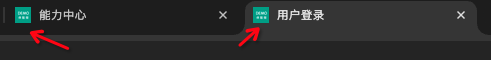

# 瓴犀项目文档

> 如果你是非前端开发人员，那么你可以看看[新手上路](./新手文档.md)这篇文档

注意，如果需要支持转化为 work/pdf 格式，可以自行寻找 markdown 转化插件

在该目录下，将按照现有文件目录结构创建对应的目录。此处将放一个大纲，方便快速定位。

- [瓴犀项目文档](#瓴犀项目文档)
  - [目录结构](#目录结构)
  - [开发前准备](#开发前准备)
  - [本地启动流程](#本地启动流程)
  - [常见问题](#常见问题)

## 目录结构

- apps
  - projects
    - admin - 平台后台
    - im - 智能客服
    - mall - PC 端商城
    - mobile - 小程序/h5 商城
    - mobile-sale - 业务员小程序
    - mobile-srm - srm 小程序
    - platform - 能力中心(商家端后台)
  - public - 涉及到多个项目的公共资源(和业务相关)
    - apis - 接口定义以及获取接口数据的方法
    - assets - 公共静态资源
    - components - 公共组件
    - config - 公共环境变量配置
    - constants - 公共常量
    - container - 公共容器
    - design - 装修相关
    - domains - 一些共用的业务逻辑
    - fixed - (可暂时忽略)
    - form - formily2.0 有关代码的导出
    - formily - formily1.0 有关代码的导出
    - layouts - 公共布局
    - locales - 国际化
    - mobile-services - 移动端一些共用的业务逻辑
    - mobile-ui - 移动端一些共用的 UI 组件
    - modules - 某些业务逻辑的封装
    - services - 一些共用的业务逻辑
    - styles - 公共样式
    - themes - 主题
    - utils - 公共工具
    - validator - 公共校验规则
- packages - 公共库，这里和业务无关
  - crypto - 加密相关
  - feature - (可暂时忽略)
  - hooks - 公共 hooks
  - icons - 图标库
  - request - 网络请求
  - router - 路由
  - scripts - (可暂时忽略)
  - standard - (可暂时忽略)
  - storage - 储存相关，包含 localStorage，sessionStorage，cookie
  - test-config - 测试代码的一些公共配置(可暂时忽略)
  - tools - 工具方法
  - tsconfig - 共用的一些 ts 类型配置(可暂时忽略)
  - ui - UI 库
  - yapi2ts - yapi 接口文档转 ts 类型
- scripts

## 开发前准备

你需要准备以下环境：

- nodejs 20.18.1
- pnpm 10.4.1
- vscode 插件
  - i18n-ally(如果需要支持国际化)
- 小程序开发者工具(如果需要开发小程序)

## 本地启动流程

1. 安装依赖

```bash
# 在根目录下执行即可，注意并不需要cd到各个目录下分别执行
pnpm install
```

2. 更新接口，生成 api 代码

```bash
cd apps/public/apis
pnpm api  # 执行后会自动生成api代码，但要注意一点是项目初始化时会使用初始化的网关，若后端此时并没有上传接口到yapi上，则不会生成对应的代码，如需更换，可以在apps/config中修改对应的环境
```

3. 启动项目这里假设是启动 admin 项目

```bash
cd apps/projects/admin
pnpm dev
```

> 除小程序外，其他项目均可通过`pnpm dev`启动，而小程序因为是多端项目，所以需要指定平台

```bash
pnpm dev:weapp # 启动微信小程序
pnpm dev:h5 # 启动h5
```

4. 打包项目所有项目都可以通过`pnpm build`打包，打包后会生成 dist 目录，其中包含打包后的文件而且小程序因为是多端项目，所以需要指定平台

```bash
pnpm build:weapp # 打包微信小程序
pnpm build:h5 # 打包h5
```

5. 预览打包后的项目所有项目都可以通过`pnpm preview`预览打包后的项目，小程序暂不支持预览打包后的项目，实际上通过开发者工具已经就是预览了

---

> 到目前为止，你已经可以启动项目了。那么接下来如果想了解更详细的文档，可以通过大纲前往 **.docs** 下对应的目录进行查看。

## 常见问题

- 如何更换网关地址

  - `apps/public/config` 中存在配置文件， 其中 index.js 的 `DEFAULT_ENV_TYPE`变量 代表当前本地使用的环境，例如 test - 对应的是 site 环境
  - 而在对应的 env.xxx.js 中 `BACK_GATEWAY` 后面的默认值，代表的就是本地使用的默认网关，线上构建时，将会使用 jenkins 传入的环境变量
  - 默认情况下会使用我们标品的网关地址，所以要记得进行更换

- 如何使用小程序的 jenkins 构建方式

  - 在微信小程序后台，找到**上传代码秘钥** 同时关闭白名单校验

    > (注意 如果你只有一个小程序，那么可以不用 2,3 这两步，直接将秘钥文件放在项目的根目录即可)

  - 新建一个 gitlab 仓库，用于存放秘钥文件，文件命名为 `weapp-mall.key`
  - 在 jenkins 上创建小程序项目，配置两个 gitlab，一个是拉取秘钥的仓库，一个是拉取代码的仓库。

- 如何更换浏览器的标签图标
  -  类似这里
  - 项目目录下存在一个 index.html， 里面存在 `src/favicon.ico` 进行更换即可
