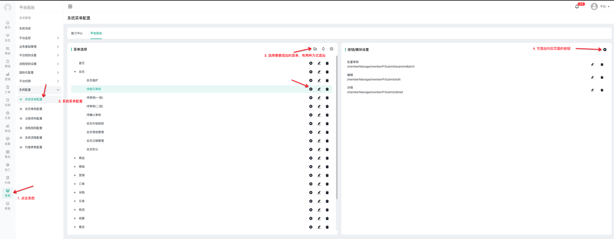
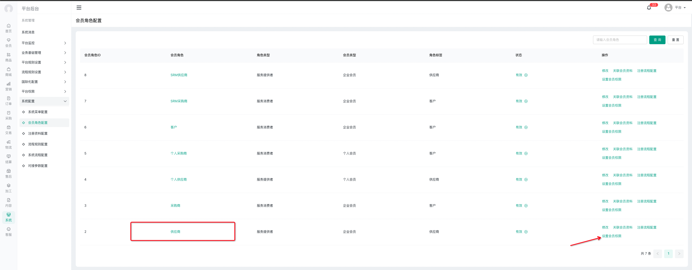
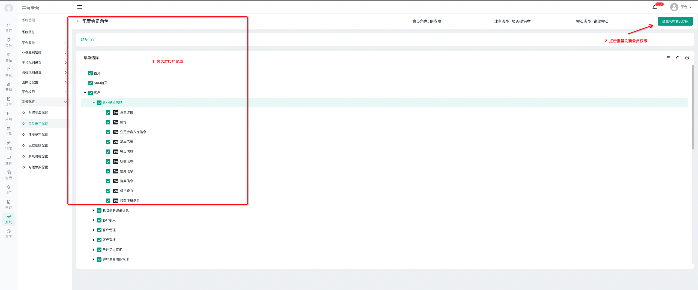

# 菜单、按钮权限

在我们系统中，路由菜单和按钮权限都是通过初始化进入的 authTree 接口返回的，并且会储存在内存中。

> 注意此处的权限控制只影响到 admin(平台后台)，platform(能力中心)项目，其他项目不影响

> 能力中心的权限是通过平台后台的角色控制的平台后台的权限是通过自身的系统能力控制的

## 如何使用

假设我们已经新建好了一个/user/list 页面，同时我们在这个页面里有一个按钮，我们取名为新增，给予的 key 是 add

为了让它生效，我们需要这样做

如果是平台后台，此时添加完毕后 只需要刷新一下页面即可看到最新菜单(前提是你登录的正好是 admin 用户，因为 admin 默认是拥有平台后台所有权限的)

那么如果你是能力中心项目，我们还需要一个步骤，即为对应角色勾上权限，假设此时我们登录的是供应商角色 

随后在设置角色权限页面中

点击批量刷新权限后，此时我们刷新能力中心，即可看到对应的菜单和按钮权限了

## 常见问题

- 如果我想添加一个不需要被权限校验的菜单该怎么做?
  - 本地照常新建页面，然后在项目的 `apps.ts` 中，有一个 `whiteList`常量，在里面添加路径即可，则不会被权限校验
